# Bases de Ionic                                     9 clases    45:06

## Introducción a la sección                                     01:38

:+1:

## Temas puntuales de la sección                                 00:20

Esta es una sección corta, pero nos prepara el suelo para la sección 5. Aquí puntualmente trabajaremos lo siguiente:

1. Navegación entre pantalla con su animación respectiva

2. Cambiar el root de la aplicación (página inicial)

3. Implementar un botón de retorno

4. Módulo para agrupar todos los componentes personalizados que hagamos.

5. Introducción al componente de listas de ionic

6. Componente header

El objetivo es dejar la base para la siguiente sección y tener una primera interacción con las funcionalidades del día a día de una aplicación de ionic.

## Inicio del proyecto - Componentes                             04:30

[Documentación Oficial de Ionic](https://ionicframework.com/), en la sección [Get Started](https://dashboard.ionicframework.com/signup?source=framework-home&hsid=b3d6f4f06431132278cc7fba82b5c233&) podemos crear una cuenta de Ionic, con lo que podemos tener acceso a recursos privados de su plataforma, hay aplacaciones en la version de pago muy interesantes, una la utilidad [ionic creator](https://creator.ionic.io) nos permite crear visualmente toda la aplicación de Ionic es decir toda la interface.

En la sección [Installation](https://ionicframework.com/docs/installation/cli) tenemos el comando:

`npm install -g ionic` que nos permite instalar Ionic CLI.

Una vez intalado Ionic podemos crear un proyecto Ionic en blanco con el siguiente comando:

`ionic start componentes black`

Esto tarda varios minutos, hasta que se nos pregunta que **framework** vamos a utilizar:

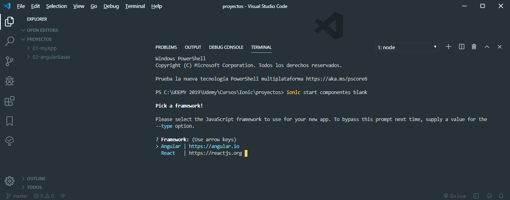

Una vez que se ha creado el proyecto, levantamos el servidor con:

`ionic serve -o`

Esto ejecuta la aplicación en la URL `http://localhost:8100/home` la cual se ve así:

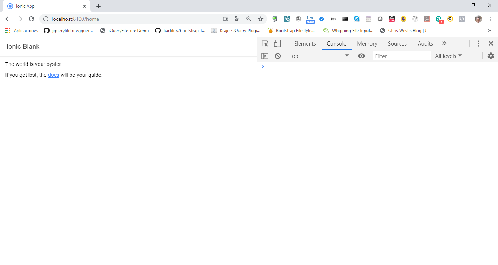

También lo podemos ver como en un dispositivo movil:

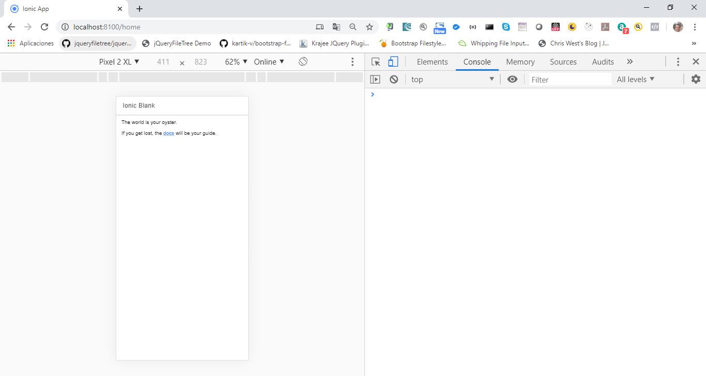

## Cambiando la pantalla principal de la aplicación              05:47

Como se puede apreciar dentro de `src/app/home` tenemos los archivos: 

```
home.module.ts
home.page.html
home.page.scss
home.page.spec.ts
home.page.ts
```

En `home.page.html` esta el texto que se ve en la página.

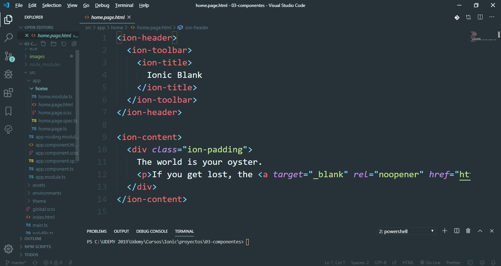

Muchos suelen dejar la `home` como el inicio de la aplicación. Nosotros vamos a borrar toda la carpeta `home` sin miedo. 

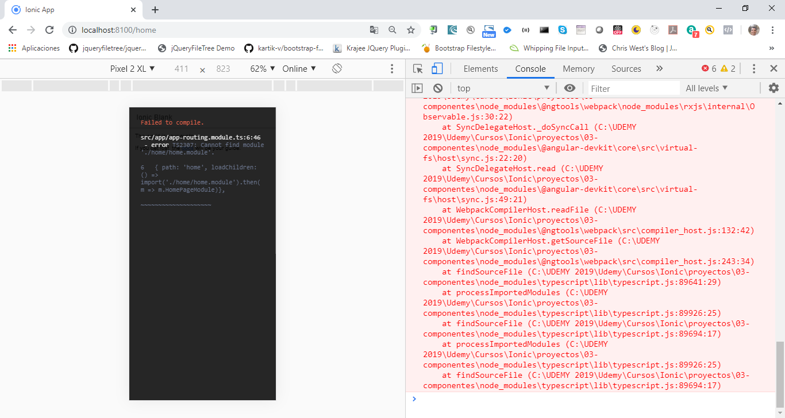

Como podemos ver el error lo tenemos en el archivo `app-routing.module.ts`, si lo abrimos vemos que tenemos:

```js
const routes: Routes = [
  { path: '', redirectTo: 'home', pathMatch: 'full' },
  { path: 'home', loadChildren: () => import('./home/home.module').then( m => m.HomePageModule)},
];
```
En el segundo `path` se hace referencia a `./home/home.module` y como lo hemos eliminado nos marca error, elimine,os esa línea.

```js
const routes: Routes = [
  { path: '', redirectTo: 'home', pathMatch: 'full' }
];
```

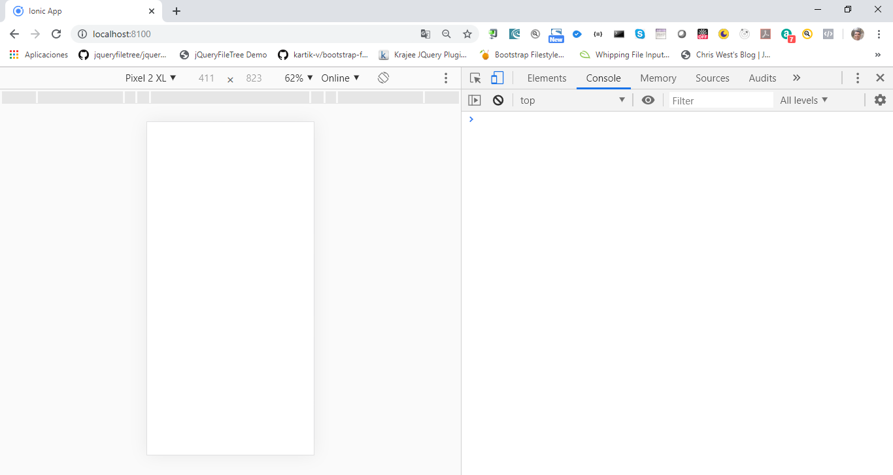

En Ionic podemos crear **páginas** y **componentes** la diferencia es que una página contiene un archivo de rutas, un componente no lo tendra. 

Para crear podemos pulsar el comando `ionic g` y se nos presentaran todas las opciones que podemos crear:

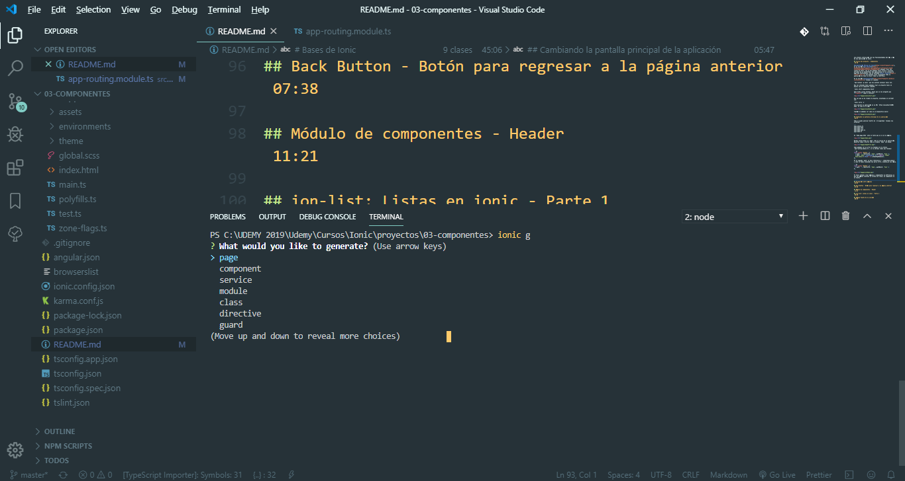

Lo que vamos a crear es una página en una carpeta `pages` que se llame `inicio`, usando:

`ng generate page pages/inicio --dry-run`

Nos indica todo lo que hara:

```
CREATE src/app/pages/inicio/inicio-routing.module.ts (347 bytes)
CREATE src/app/pages/inicio/inicio.module.ts (472 bytes)
CREATE src/app/pages/inicio/inicio.page.html (125 bytes)
CREATE src/app/pages/inicio/inicio.page.spec.ts (647 bytes)
CREATE src/app/pages/inicio/inicio.page.ts (256 bytes)
CREATE src/app/pages/inicio/inicio.page.scss (0 bytes)
UPDATE src/app/app-routing.module.ts (493 bytes)
```

Ejecutamos el comando:

`ng generate page pages/inicio`

Esto nos crea todo lo anterior

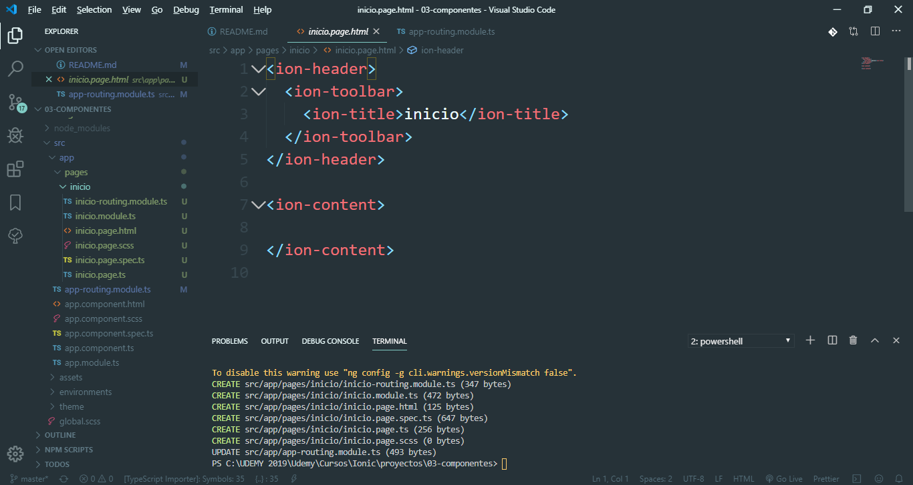

Podemos observar que en el archivo `app-routing.module.ts` se ha incluido la ruta LazyLoad para esta nueva página:

```js
const routes: Routes = [
  { path: '', redirectTo: 'home', pathMatch: 'full' },
  {
    path: 'inicio',
    loadChildren: () => import('./pages/inicio/inicio.module').then( m => m.InicioPageModule)
  }
];
```

Solo debemos cambiar que la redirección se haga a `inicio` en lugar de `home` como estaba anteriormente.

```
const routes: Routes = [
  { path: '', redirectTo: 'inicio', pathMatch: 'full' },
  {
    path: 'inicio',
    loadChildren: () => import('./pages/inicio/inicio.module').then( m => m.InicioPageModule)
  }
];
```

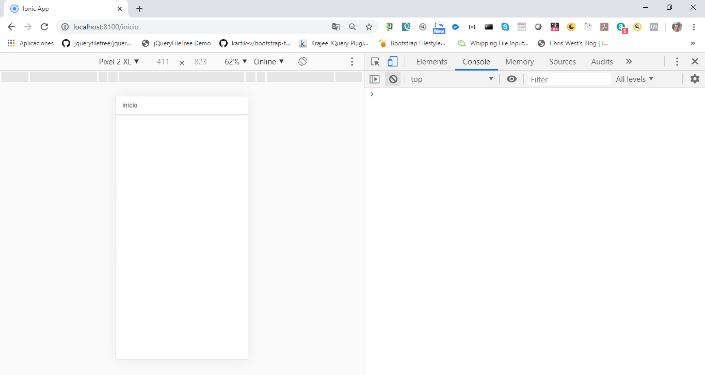

## Navegación entre páginas                                      05:03

Aquí vamos a navegar entre páginas por lo cual crearemos dos páginas más:

### Crear nuevas páginas

`ng generate page pages/alert --spec=false`

`ng generate page pages/action-sheet --spec=false`

Nos indica:

```
CREATE src/app/pages/alert/alert-routing.module.ts (343 bytes)
CREATE src/app/pages/alert/alert.module.ts (465 bytes)
CREATE src/app/pages/alert/alert.page.html (124 bytes)
CREATE src/app/pages/alert/alert.page.ts (252 bytes)
CREATE src/app/pages/alert/alert.page.scss (0 bytes)
UPDATE src/app/app-routing.module.ts (614 bytes)

CREATE src/app/pages/action-sheet/action-sheet-routing.module.ts (368 bytes)
CREATE src/app/pages/action-sheet/action-sheet.module.ts (509 bytes)
CREATE src/app/pages/action-sheet/action-sheet.page.html (131 bytes)
CREATE src/app/pages/action-sheet/action-sheet.page.ts (279 bytes)
CREATE src/app/pages/action-sheet/action-sheet.page.scss (0 bytes)
UPDATE src/app/app-routing.module.ts (760 bytes)
```

Se crean las páginas con sus respectivos archivos de rutas y se modifica el archivo `app-routing.module.ts` para incluirlas.

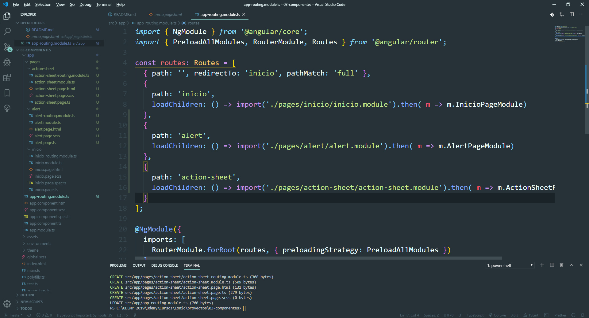

Si queremos verlas basta poner su respectivo URL:

`http://localhost:8100/alert`

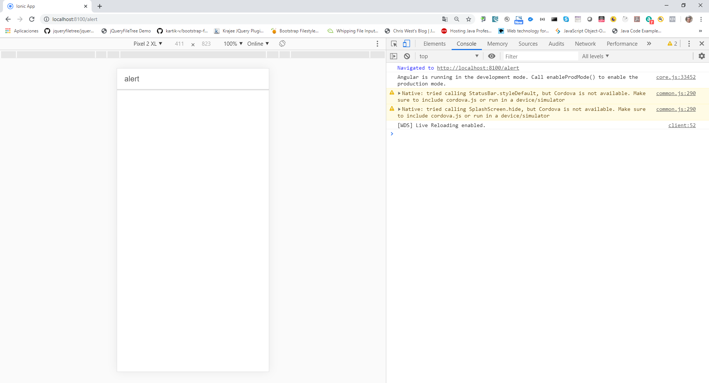

`http://localhost:8100/action-sheet`
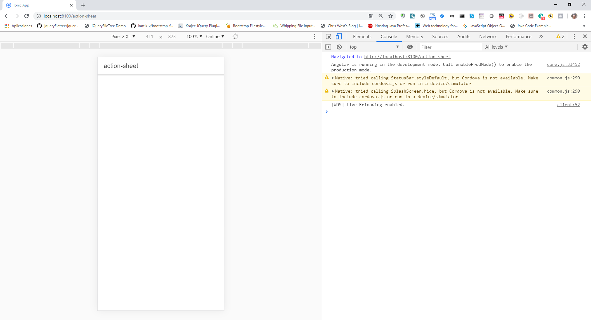

### Navegar entre páginas

Vamos a meter un par de botones en `inicio.page.html` que nos lleven a cada una de las páginas:

```js
<ion-content class="ion-padding">
  <ion-button routerLink="/alert">Alert</ion-button>
  <ion-button routerLink="/action-sheet">Action Sheet</ion-button>
</ion-content>
```
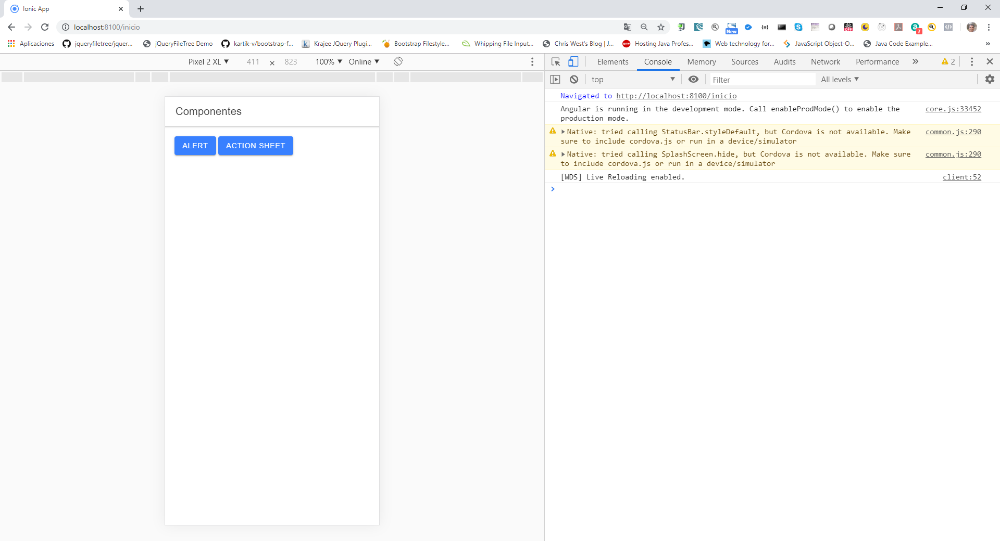

Estamos el método tradicional de Angular usando `routerLink` para movernos a la página deseada.

Podemos ver como se vera en un Iphone:

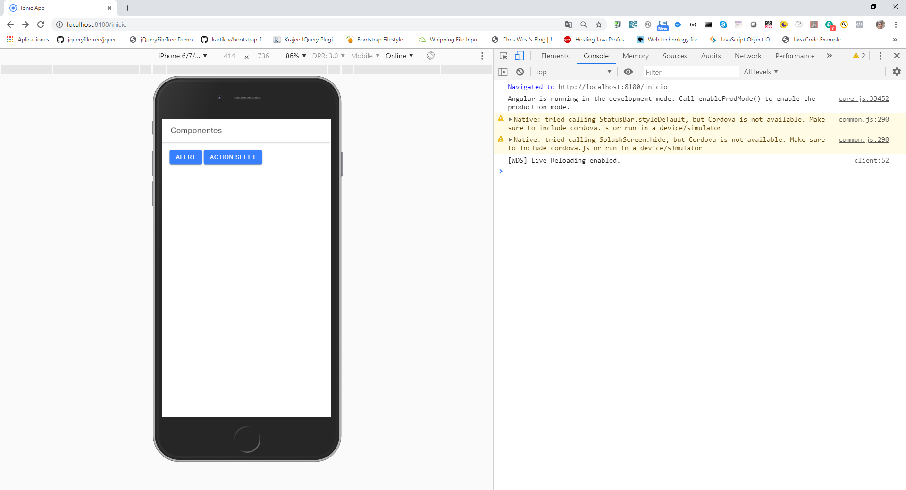

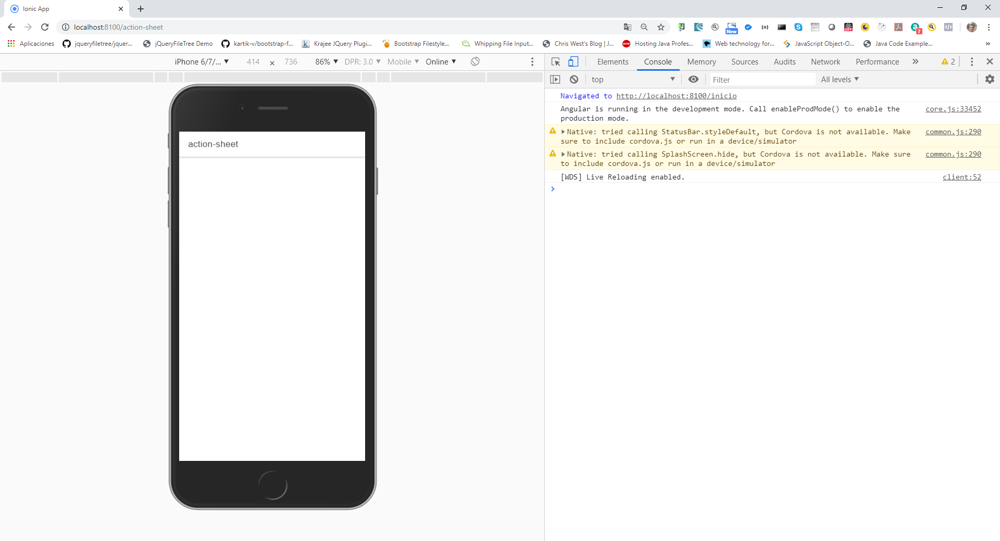

## Back Button - Botón para regresar a la página anterior        07:38

Vamos a implementar el Back Button en nuestras ppáginas **alert** y **action-sheet**. En el `header` dentro del `toolbar` podemos indicar que tendremos la sección de botones con el tag `<ion-buttons>` y dentro de ella poner el o los botones deseados en este caso `<ion-back-button>`, por lo que el código a insertar es:

```js
<ion-buttons>
  <ion-back-button></ion-back-button>
</ion-buttons>
```

Vamos a ver como se ve este botón en un Iphone y en un Pixel:

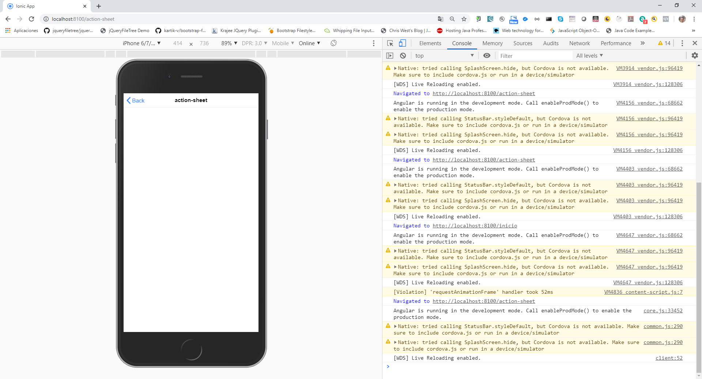

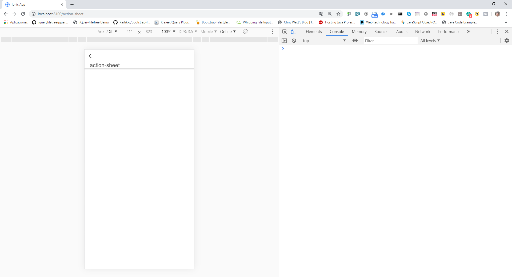

Como se puede apreciar en el Iphone se ve bien pero no en el Pixel, en el Header es como si ubieran tres secciones para colocar los botones:

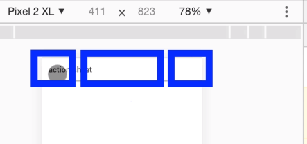

### Atributo slot

Como queremos forzar que nuestro botón de Back este en la primer sección en el Header lo forzamos con el atributo `slot="start"`, por lo que el código queda así:

```js
<ion-buttons slot="start">
  <ion-back-button></ion-back-button>
</ion-buttons>
```

Con esto nuestro botón Back ya se ve correcto en el Pixel:

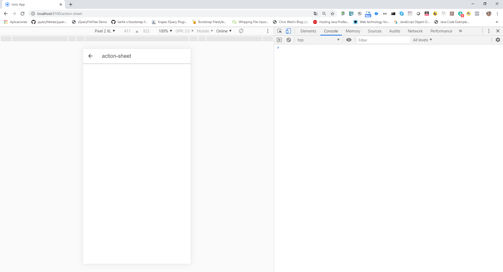

Pero ahora el problema que tenemos es que si estando en la página `action-sheet` y refrescamos la página el botón de Back desaparece.

### Atributo defaultHref

Para forzar que aunque refresquemos la pantalla el botón de Back siga apareciendo tenemos que poner el atributo `defaultHref="/"`, el / en teoria le dice que redireccione a la página / pero / no existe, en teoria entonces redirecciona a inicio por lo que tambien podría poner `defaultHref="/inicio"`, esto es para forzar a creer que hay una historia de páginas si se refresca la página. 

### Atributo text

Como podemos observar en Iphone el botón Back aparece como `<Back` si queremos cambiar ese texto poara que aparezca en español podemos usar el atributo `text` por lo que nuestro código queda así:

```js
<ion-buttons slot="start">
  <ion-back-button text="Regresar" defaultHref="/"></ion-back-button>
</ion-buttons>
```

Como podemos ver en el IPhone el texto ya sale en Español:

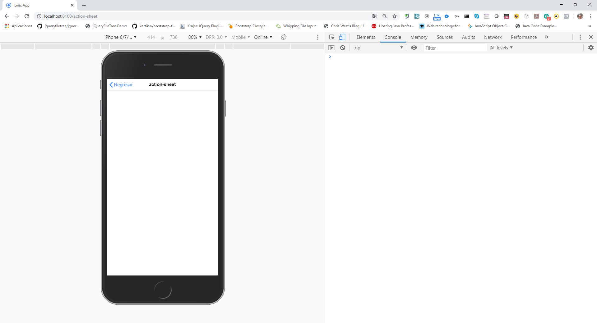

Pero ahora el texto también aparece en un Pixel (cosa que antes no hacia):

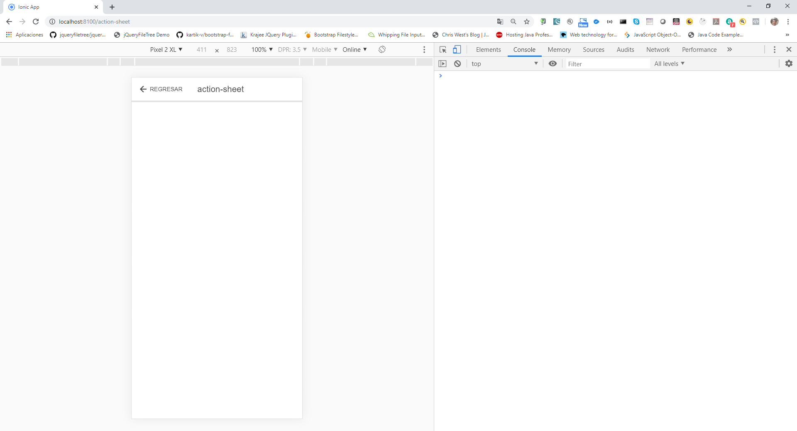

### Back Button en página alert

Finalmente vamos a copiar el BackButon también en la página alert:

```js
<ion-buttons slot="start">
  <ion-back-button text="Regresar" defaultHref="/"></ion-back-button>
</ion-buttons>
```

## Módulo de componentes - Header                                11:21

Como hemos podido ver el Header que tenemos en nuestras dos páginas `alert` y `action-sheet` son muy parecidos, podriamos tener un componente `header` que inyectaramos en cada página para no repetir código, de esto trata esta sección. Crearemos un módulo que contenga todos nuestros componentes.

### Creación de modulo components

Vamos a crear un modulo que contenga todos nuestros componentes, el comando es:

`ionic g module components --dry-run`

Nos indica que:

`CREATE src/app/components/components.module.ts (196 bytes)`

Como es lo que queremos lo ejecutamos sin `--dry-run`:

`ionic g module components --dry-run`


### Crear componente header

Ahora lo que vamos a crear es el componente header:

`ng generate component components/header --spec=false`

Crea el componente y se incluye en `components.module.ts`.

```js
import { NgModule } from '@angular/core';
import { CommonModule } from '@angular/common';
import { HeaderComponent } from './header/header.component'

@NgModule({
  declarations: [
    HeaderComponent
  ],
  imports: [
    CommonModule
  ]
})
export class ComponentsModule { }
```

### Incluir el nuevo modulo components en app.module.ts

Para decirle a Ionic que este nuevo módulo components lo pueda utilizar debemos incluirlo en `app.module.ts`.

```
imports: [
    BrowserModule, 
    IonicModule.forRoot(), 
    AppRoutingModule,
    ComponentsModule
  ],
```

### Uso del componente header

Vamos a comentar el header que tenemos en la página de alert.html y meteremos nuestro nuevo componente:

```js
<app-header></app-header>
<!--
<ion-header>
  <ion-toolbar>
    <ion-buttons slot="start">
      <ion-back-button text="Regresar" defaultHref="/"></ion-back-button>
    </ion-buttons>
    <ion-title>alert</ion-title>
  </ion-toolbar>
</ion-header>
-->
<ion-content>

</ion-content>
```
Al intentar cargar la pagina alert tenemos un error:

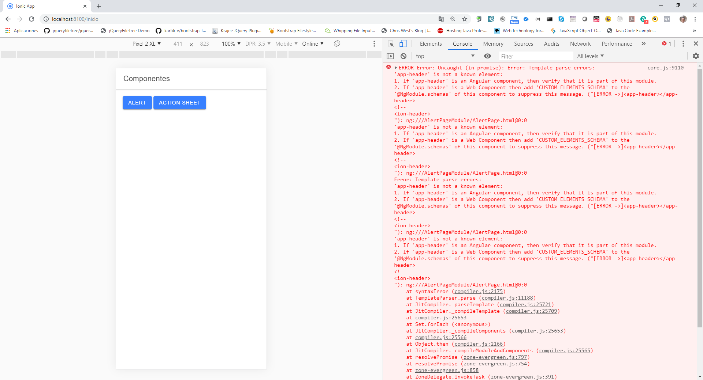

`'app-header' is not a known element:` No me esta reconociendo el `app-header`.

En este caso como esta cargado mediante LazyLoad necesitamos indicar en el `alert.module.ts` que ahora dispone de un modulo de componentes, que los busque allí, en caso que necesite un componente que lo revise en ese modulo, por lo que tenemos que importar el `ComponentsModule` en `alert.module.ts`:

```js
import { ComponentsModule } from '../../components/components.module'

@NgModule({
  imports: [
    CommonModule,
    FormsModule,
    IonicModule,
    AlertPageRoutingModule,
    ComponentsModule
  ],
```

Pero aun añadiendo esto, el error lo seguimos teniendo, ¿Por que? Si revisamos nuestro `Components.module`:

```js
import { NgModule } from '@angular/core';
import { CommonModule } from '@angular/common';
import { HeaderComponent } from './header/header.component'

@NgModule({
  declarations: [
    HeaderComponent
  ],
  imports: [
    CommonModule
  ]
})
export class ComponentsModule { }
```

Nos esta faltando algo, nos falta indicar que ese `HeaderComponent` va a poder ser usado en el exterior en modulos fuera de este modulo, es decir nos falta el Exports:

```js
import { NgModule } from '@angular/core';
import { CommonModule } from '@angular/common';
import { HeaderComponent } from './header/header.component'

@NgModule({
  declarations: [
    HeaderComponent
  ],
  exports: [
    HeaderComponent
  ],
  imports: [
    CommonModule
  ]
})
export class ComponentsModule { }
```
Solo debemos exportar aquellos componentes que se van a ocupar fuera. Si cargamos nuevamente la página y vamos a `alert` ya no nos carga el error y se muestra la página como la tenemos hasta ahora.

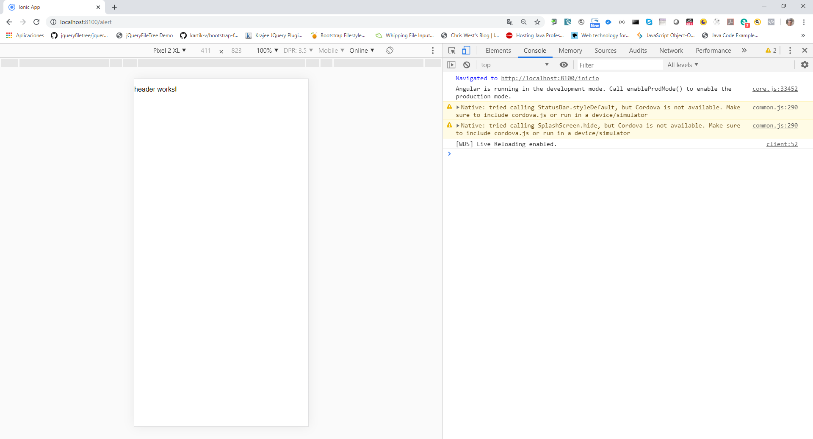

Para que se vea como antes vamos a cortar el texto que teniamos comentado y lo metemos en el componente `header`

Al hacer esto nos marca un error ya que no reconoce los Tags de Ionic en `header.component.html` por que todos esos componentes vienen del `IonicModule`, si vemos el archivo `app.module.ts`:

```js
import { NgModule } from '@angular/core';
import { BrowserModule } from '@angular/platform-browser';
import { RouteReuseStrategy } from '@angular/router';

import { IonicModule, IonicRouteStrategy } from '@ionic/angular';
import { SplashScreen } from '@ionic-native/splash-screen/ngx';
import { StatusBar } from '@ionic-native/status-bar/ngx';

import { AppComponent } from './app.component';
import { AppRoutingModule } from './app-routing.module';
import { ComponentsModule } from './components/components.module';


@NgModule({
  declarations: [AppComponent],
  entryComponents: [],
  imports: [
    BrowserModule, 
    IonicModule.forRoot(), 
    AppRoutingModule,
    ComponentsModule
  ],
  providers: [
    StatusBar,
    SplashScreen,
    { provide: RouteReuseStrategy, useClass: IonicRouteStrategy }
  ],
  bootstrap: [AppComponent]
})
export class AppModule {}
```

Vemos que tenemos importado `IonicModule.forRoot(),` que es el encargado de importar todos los componentes de Ionic, vamos a tener que hacer exactamente lo mismo en nuestro `components.module.ts`

```js
import { NgModule } from '@angular/core';
import { CommonModule } from '@angular/common';
import { HeaderComponent } from './header/header.component'
import { IonicModule } from '@ionic/angular';

@NgModule({
  declarations: [
    HeaderComponent
  ],
  exports: [
    HeaderComponent
  ],
  imports: [
    CommonModule,
    IonicModule
  ]
})
export class ComponentsModule { }
```

Si probamos nuestra página esta ya funciona correctamente.

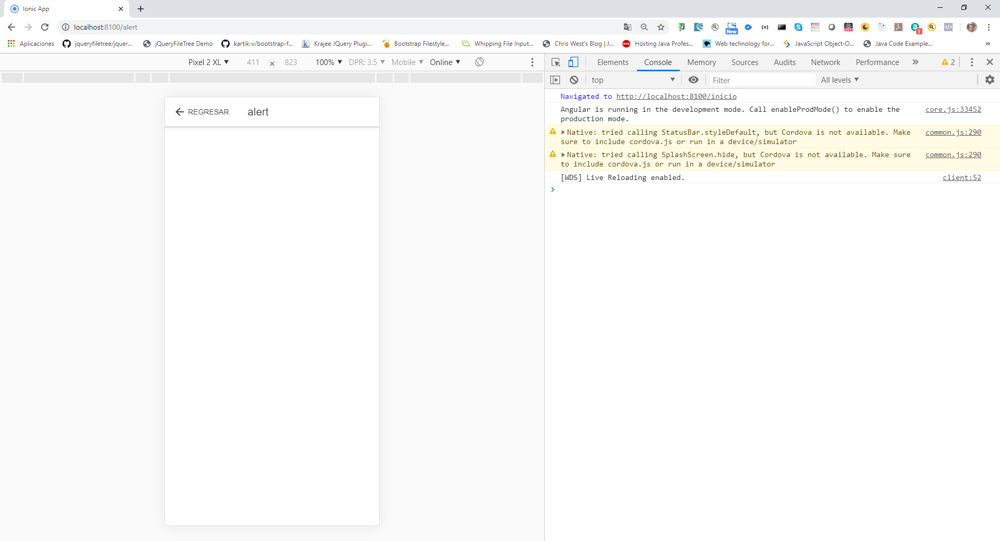

Solo que existe un pequeño detalle para que nuestro componente `header` funcione correctamente el `title` que pone no es dinamici `<ion-title>alert</ion-title>`. Para lo cual tenemos que hacer que reciba ese dato para que lo pinte dinamicamente.

### Recibir el título mediante @Input

Em el archivo `header.components.ts` vamos a indicar que vamos a recibir la propiedad titulo:

`@Input() titulo: string;`

Y ese es que debemos usar en el `header.component.html`:

`<ion-title class="ion-text-capitalize">{{ titulo }}</ion-title>`

Hemos usado la `class="ion-text-capitalize"` para que salga siempre en capitalizado.

Nos falta mandar la información desde `alert.page.html`:

`<app-header titulo="Alert Page"></app-header>`

En este caso estamos mandando en `titulo` el valor del string `Alert Page`, recuerde que si se pusiera titulo entre corchetes:

`<app-header [titulo]="AlertPage"></app-header>`

lo que se le diria es que busque la variable `AlertPage` en el `ts` y se mande su valor, pero en este caso eso no aplica aquí por lo que nos quedamos con:

`<app-header titulo="Alert Page"></app-header>`

Si vamos a alert ya fuinciona correctamente usando el componente `header`.

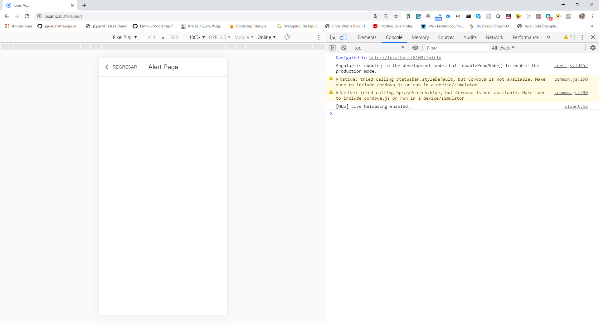

### Usar el componente header en la página action-sheet

1. Modificar el archivo `action-sheet.page.html` para que haga referencia al componente y mandemos el valor del `titulo`.

```js
<app-header titulo="Action-Sheet Page"></app-header>

<ion-content>

</ion-content>
```

2. Modificar el archivo `action-sheet.module.ts` para incluir el modulo de los componentes, para que allí pueda buscar el componente que necesite:

```js
import { NgModule } from '@angular/core';
import { CommonModule } from '@angular/common';
import { FormsModule } from '@angular/forms';

import { IonicModule } from '@ionic/angular';

import { ActionSheetPageRoutingModule } from './action-sheet-routing.module';

import { ActionSheetPage } from './action-sheet.page';

import { ComponentsModule } from '../../components/components.module'

@NgModule({
  imports: [
    CommonModule,
    FormsModule,
    IonicModule,
    ActionSheetPageRoutingModule,
    ComponentsModule
  ],
  declarations: [ActionSheetPage]
})
export class ActionSheetPageModule {}
```

Con esto ya tenemos nuestro flujo entre páginas usando el componente `header` en cada una de ellas:

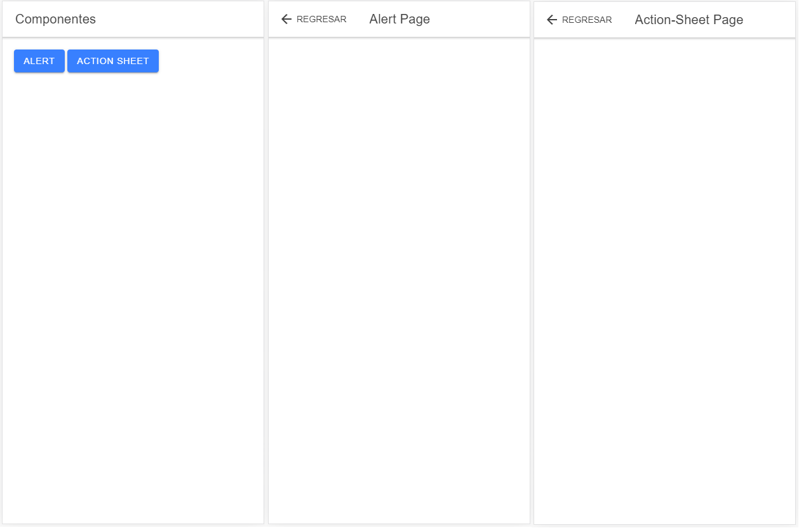

### Quitar el borde del header con atributo `no-border`
Podemos quitar el borde del header usando el atributo `no-border`, vamos al archivo `header.component.html` y le ponemos ese atributo:

```js
<ion-header no-border>
    <ion-toolbar>
      <ion-buttons slot="start">
        <ion-back-button text="Regresar" defaultHref="/"></ion-back-button>
      </ion-buttons>
      <ion-title class="ion-text-capitalize">{{ titulo }}</ion-title>
    </ion-toolbar>
  </ion-header>
```

Como la página de inicio también tiene el borde, vayamos a `inicio.page.html` y pongamos el atributo `no-border`.

```js
<ion-header no-border>
  <ion-toolbar>
    <ion-title>Componentes</ion-title>
  </ion-toolbar>
</ion-header>
```

Finalmente así quedan las páginas:

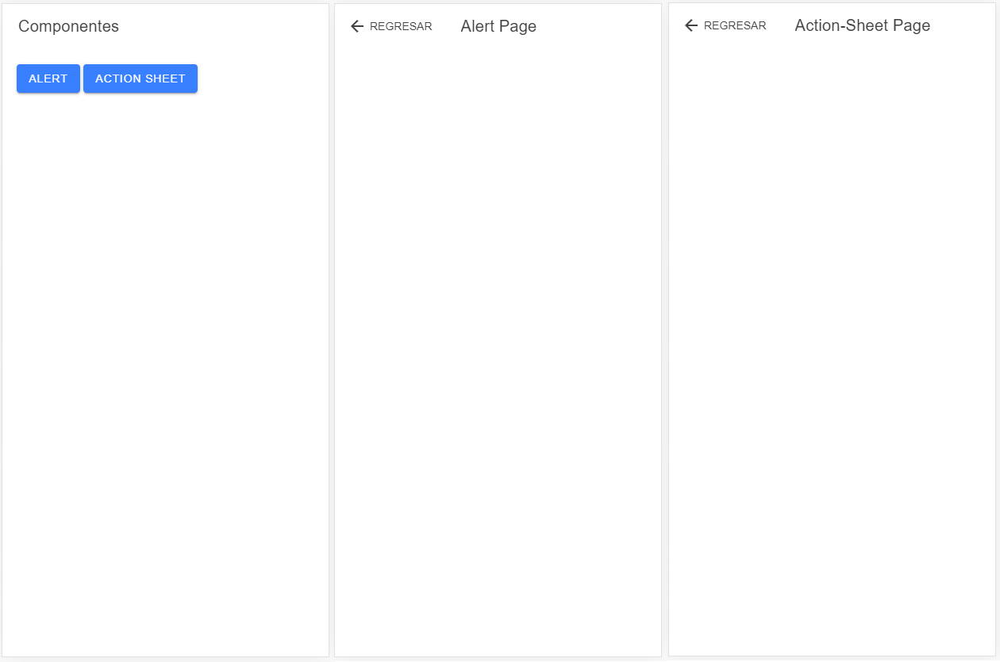

## ion-list: Listas en ionic - Parte 1                           08:30

Vamos a añadir una lista en nuestro archivo `inicio.page.html`

```js
<ion-list>
  <ion-item>
    <ion-label>Alert</ion-label>
  </ion-item>
  <ion-item>
    <ion-label>Action Sheet</ion-label>
  </ion-item>
</ion-list>
```
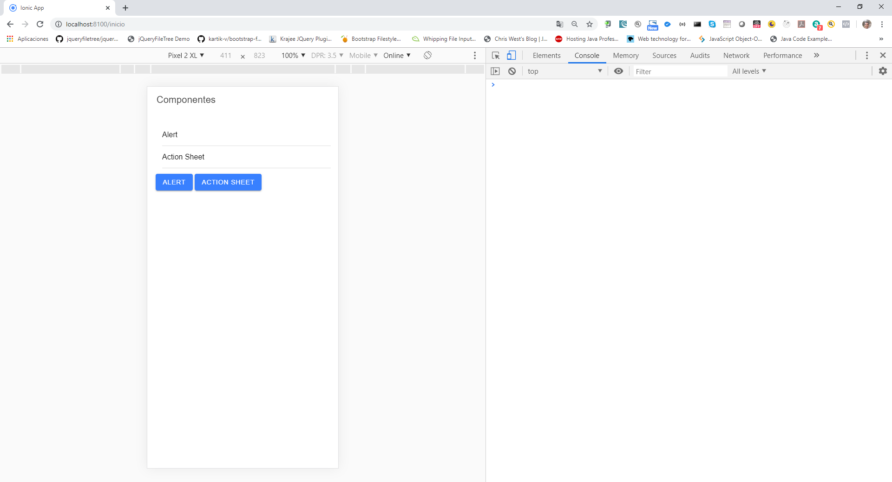

### Añadir el RoutingLink para ir a las paginas

Podemos añadir los routerLinks a los items para que se vaya a cada página:

```js
<ion-list>
  <ion-item routerLink="/alert">
    <ion-label>Alert</ion-label>
  </ion-item>
  <ion-item routerLink="/action-sheet">
    <ion-label>Action Sheet</ion-label>
  </ion-item>
</ion-list>
```

Si cargamos la página apreciamos que en el iPhone nos pone `>` que ayuda a distinguir que esa opción de la lista nos llevará a otro lado, en cambio en Android la opción de la lista no se distigue para saber que pueda ser pulsada:

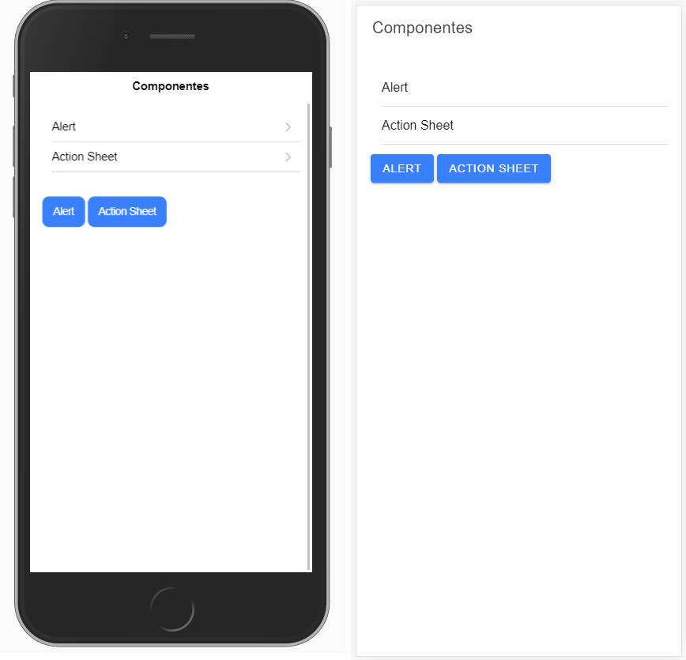

### Atributo Detail

Para forzar que en Android tambien muestre el simbolo `>` podemos añadir el atributo `detail`

```js
<ion-list>
  <ion-item routerLink="/alert" detail>
    <ion-label>Alert</ion-label>
  </ion-item>
  <ion-item routerLink="/action-sheet" detail>
    <ion-label>Action Sheet</ion-label>
  </ion-item>
</ion-list>
```

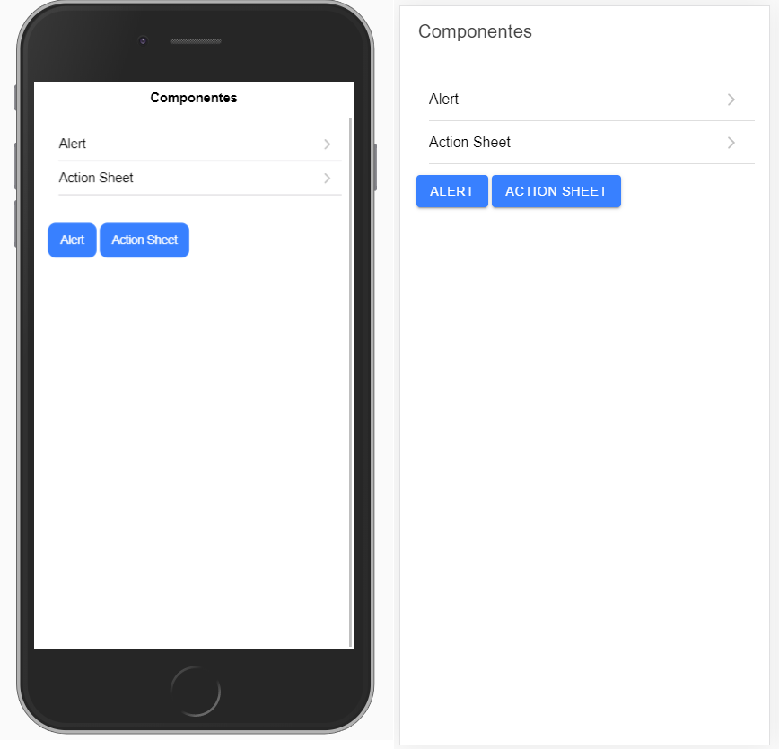

La anterior sería la forma manual de incluir manualmente cada uno de los elementos de la lista, pero lo podemos hacer dinámicamente.

### Crear la lista de componentes dinámicamente

En nuestro archivo `inicio.page.html` vamos a quitar el segundo elemento de la lista y los botones.

```js
<ion-header no-border>
  <ion-toolbar>
    <ion-title>Componentes</ion-title>
  </ion-toolbar>
</ion-header>

<ion-content class="ion-padding">
  <ion-list>
    <ion-item routerLink="/alert" detail>
      <ion-label>Alert</ion-label>
    </ion-item>
  </ion-list>
</ion-content>
```

Ahora en el archivo `inicio.page.ts` vamos a incluir un array con todos los componentes que vamos a tener, pero estos componentes tienen que ser de tipo `Componente` para lo cual creamos una interface `Componente` con los datos que queramos y ya podemos incluir el array de ese tipo:

```js
import { Component, OnInit } from '@angular/core';

@Component({
  selector: 'app-inicio',
  templateUrl: './inicio.page.html',
  styleUrls: ['./inicio.page.scss'],
})
export class InicioPage implements OnInit {

  componentes: Componente[] = [
    {
      icon: 'american-football',
      name: 'Action Sheet',
      redirectTo: '/action-sheet'
    },
    {
      icon: 'appstore',
      name: 'Alert',
      redirectTo: '/alert'
    }
  ];

  constructor() { }

  ngOnInit() {
  }

}

interface Componente {
  icon: string;
  name: string;
  redirectTo: string;
}
```

### Uso del array de componentes

Vamos a usar el array de componentes en nuestro archivo `inicio.page.ts`:

```js
<ion-header no-border>
  <ion-toolbar>
    <ion-title>Componentes</ion-title>
  </ion-toolbar>
</ion-header>

<ion-content class="ion-padding">
  <ion-list>
    <ion-item *ngFor="let c of componentes"
              [routerLink]="c.redirectTo" detail>      
      <ion-label>{{ c.name }}</ion-label>
    </ion-item>
  </ion-list>
</ion-content>
```
De esta forma estamos incluyendo dinamicamente los diferentes componentes:


### Uso de <ion-icon> para pintar un icono

Podemos usar la etiqueta  `<ion-icon slot="start" [name]="c.icon"></ion-icon>` para que nos pinte el icono que definimos en el arreglo, con `slot="start"` lo colocamos al inicio:

```js
<ion-header no-border>
  <ion-toolbar>
    <ion-title>Componentes</ion-title>
  </ion-toolbar>
</ion-header>

<ion-content class="ion-padding">
  <ion-list>
    <ion-item *ngFor="let c of componentes"
              [routerLink]="c.redirectTo" detail>
      <ion-icon slot="start" [name]="c.icon"></ion-icon>
      <ion-label>{{ c.name }}</ion-label>
    </ion-item>
  </ion-list>
</ion-content>
```

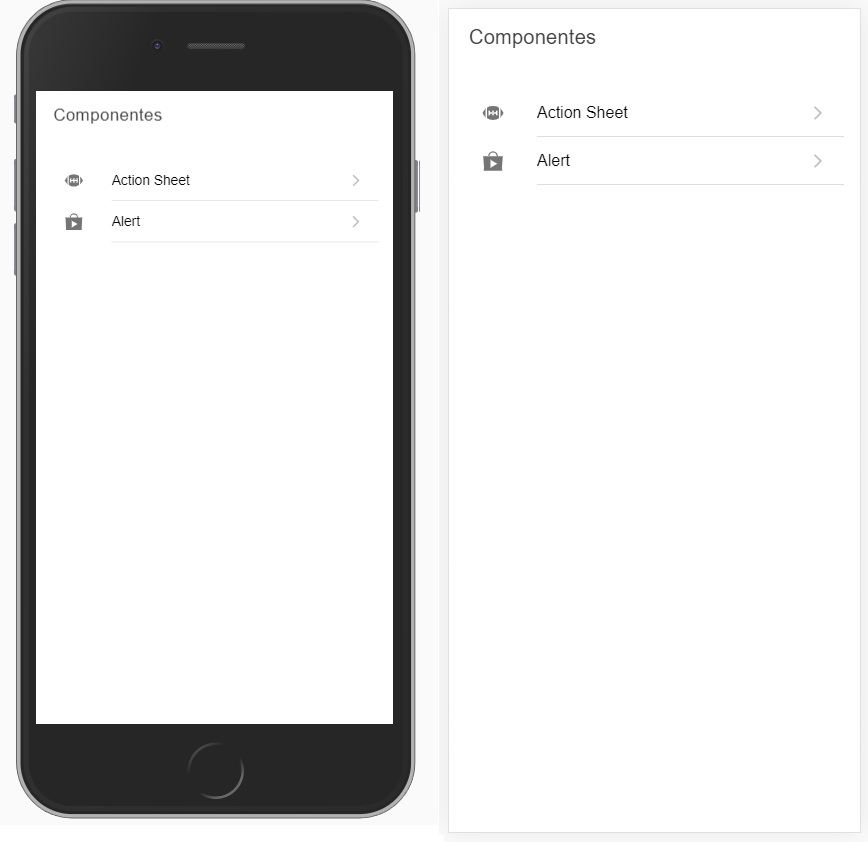

## Código fuente de la sección                                   00:19
